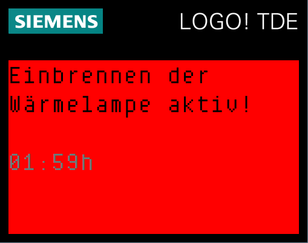
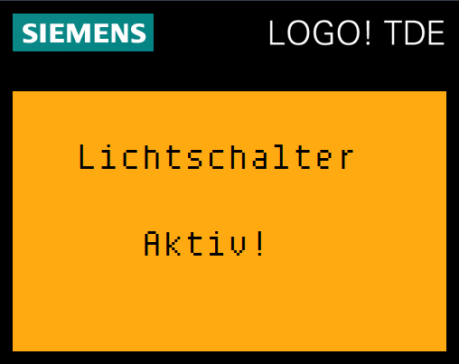
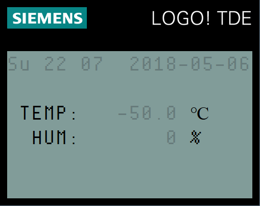
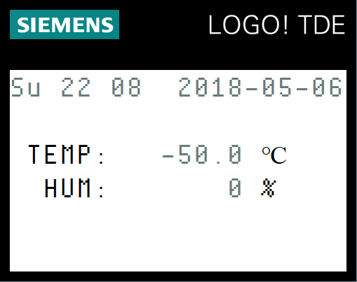

# Dokumentation Terrariensteuerung über SIEMENS LOGO!

## 1 – Display Meldungen und Funktionstasten
Die LOGO! kann verschiedene Display-Meldungen ausgeben.  
Einige dieser Meldungen werden im automatisierten Programmablauf erzeugt, andere wiederum sind ein optischer Hinweis für einen manuellen Eingriff in die Seuerung.

Das LOGO! TDE verfügt über 4 Funktionstasten.
Hinter jeder Taste steht ein spezieller Eingriff in den automatisierten Ablauf.  

### Kontaktfehler TEMP_01 / TEMP_02
Die Temperatur wird über 2 PT-100 Temperaturfühler vorgenommen.  
Ist die Verbindung zu einem der Sensoren gestört, bzw. unterbrochen, befindet sich der Messwert, welchen die LOGO! ermittelt bei -50°C.  
In diesem Fall ist von einem Verbindungsabbruch aus zu gehen, auf welchen die LOGO! mit einer entsprechenden Warnmeldung hinweist.  
Zusätzlich kann die Wärmelampe in diesem Zustand NICHT eingeschaltet werden, um eine Überhitzung des Terrariums zu verhindern.  

### Einbrennen der UV HID Metalldampflampe (Wärmelampe)
Die Taste F1 schaltet die Steuerung in den Wartungsmodus für die Wärmelampe.
Zur ersten Inbetriebnahme der Lampe muss diese Minimum 2h am Stück betrieben werden.
Über die Taste F1 kann dies nach einem Austausch des Leuchtmittels erreicht werden.  

### Einschalten der Tageslichtbeleuchtung
Die Taste F2 schaltet die Tagesbeleuchtung ein, falls sich diese durch die Automatik im Zustand AUS befindet.
Eine erneute Betätigung der Taste F2 schaltet das Licht wieder aus.
Das Display zeigt einen entsprechenden Hinweis.

### Einschalten der manuellen Bewässerung
Über die Taste F3 wird eine manuelle Bewässerung durchgeführt (noch nicht implementiert).  
Die manuelle Bewässerung ist nur möglich, wenn der Wasserstand im Tank ausreichend ist.

### Hintergrundbeleuchtung LOGO! TDE-Display
Die Taste F4 schaltet die normale Display-Beleuchtung an und wieder aus.
Die Hintergrundbeleuchtung erlischt aber auch automatisch nach 5 Sekunden.  
  

