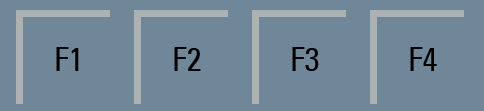

# Dokumentation Terrarien Steuerung über SIEMENS LOGO!

## 1 – Display und Funktionstasten
Das LOGO! TDE verfügt über 4 Funktionstasten.
Hinter jeder Taste steht ein spezieller Eingriff in den automatisierten Ablauf.

### Taste F1:
Einbrennen der UV HID Metalldampflampe (Wärmelampe)
Die Taste F1 schaltet die Steuerung in den Wartungsmodus für die Wärmelampe.
Zur ersten Inbetriebnahme der Lampe muss diese Minimum 2h am Stück betrieben werden.
Über die Taste F1 kann dies nach einem Austausch des Leuchtmittels erreicht werden.

### Taste F2:
Die Taste F2 schaltet die Tagesbeleuchtung ein, falls sich diese durch die Automatik im Zustand AUS befindet.
Eine erneute Betätigung der Taste F2 schaltet das Licht wieder aus.
Das Display zeigt einen entsprechenden Hinweis.

### Taste F3:
Über die Taste F3 wird eine manuelle Bewässerung durchgeführt (noch nicht implementiert)

### Taste F4:
Die Taste F4 schaltet die normale Display-Beleuchtung an und wieder aus.
Die Hintergrundbeleuchtung erlischt aber auch automatisch nach 5 Sekunden
